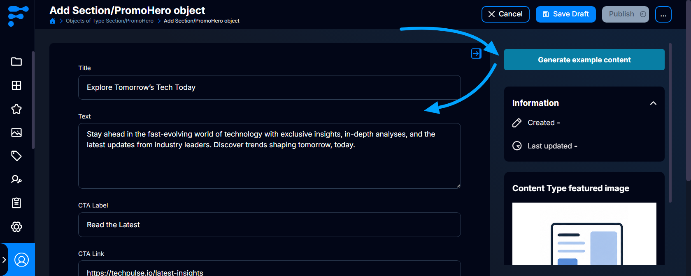

# AI Example Content

This Flotiq UI plugin adds an AI example-content action to the sidebar of every create-object form. It uses OpenAI to generate values based on the current Content Type Definition and optionally tailored to your project description.



## Configuration

Open the plugin settings in Flotiq and configure:
- **OpenAI API key** - required OpenAI project API key.
- **Project description** - optional context that shapes the generated content.

The key is read only at runtime from plugin settings. Because this plugin calls OpenAI from the browser, use a restricted, revocable project key with a spend limit. Do not use an unrestricted personal or organization key.

## Usage

1. Open the form for creating a new object.
2. Select **Generate example content** in the sidebar.
3. Review and edit the populated values as needed.
4. Select **Generate again** to replace the supported values with a new, varied example.
5. Submit the form normally when the result is ready.

The generator supports string text, richtext, number, integer, boolean, date, and datetime fields. It leaves media, relations, and unsupported custom field types unchanged. The plugin never creates or submits a content object itself.

## Local development

```bash
yarn install
yarn start
```

Load `https://localhost:3053/plugin-manifest.json` in Flotiq after trusting the local development certificate. For a production installation, host the built `dist/index.js` and `dist/plugin-manifest.json` over HTTPS, then update the `url` in [plugin-manifest.json](plugin-manifest.json) before building.

Build the distributable bundle with:

```bash
yarn build
```
